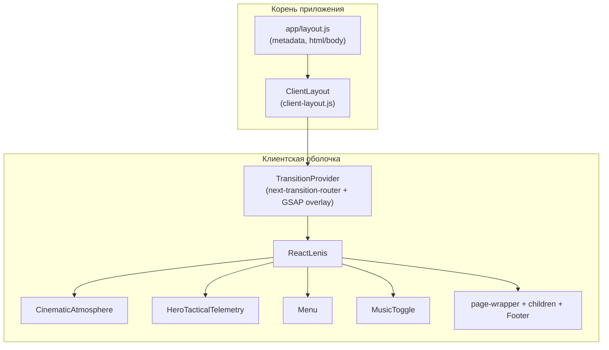

<div align="center">

# Last Signal

**Кинематографичный промо-сайт** с плавным скроллом, сеточными переходами между страницами и монохромной визуальной атмосферой.

[](https://nextjs.org/)
[](https://react.dev/)
[](https://gsap.com/)

</div>

---

## Содержание

- [О проекте](#о-проекте)
- [Ключевые возможности](#ключевые-возможности)
- [Технологический стек](#технологический-стек)
- [Требования к окружению](#требования-к-окружению)
- [Быстрый старт](#быстрый-старт)
- [Скрипты npm](#скрипты-npm)
- [Архитектура](#архитектура)
- [Структура репозитория](#структура-репозитория)
- [Маршруты и страницы](#маршруты-и-страницы)
- [Стили и тема](#стили-и-тема)
- [Сборка для production](#сборка-для-production)
- [Автор](#автор)

---

## О проекте

**Last Signal** — это одностраничное ядро (лендинг) с дополнительными разделами, оформленными как отдельные маршруты Next.js. Пользовательский опыт строится вокруг:

- **плавного вертикального скролла** (Lenis, разные профили для десктопа и мобильных);
- **анимаций по скроллу и при смене маршрута** (GSAP + `next-transition-router`);
- **слоя атмосферы** (виньетка, сканлайны, зерно, «пыль») поверх интерфейса;
- **3D-сцены каталога** на Three.js.

Корневой layout минимален: вся интерактивная оболочка вынесена в клиентский компонент [`src/client-layout.js`](src/client-layout.js), чтобы не смешивать серверный `layout` с провайдерами скролла и переходов.

---

## Ключевые возможности

| Область | Реализация |
|--------|------------|
| Плавный скролл | `ReactLenis` из `lenis/react`, настройки под ширину экрана |
| Переходы между страницами | `TransitionRouter` + GSAP: сетка ячеек, масштабирование |
| Типографика и появление текста | `SplitText`, `ScrollTrigger` в компонентах секций |
| Сложные сцены по скроллу | `ScrollTrigger` (Report, CTA, Footer, Transmit и др.) |
| Морфинг раскладки | `Flip` (блок Showreel) |
| Горизонтальная хроника | `Observer` + `SplitText` на странице Chronicles |
| Каталог | WebGL: `THREE.WebGLRenderer`, геометрия, текстуры |
| Глобальный HUD | Фиксированная телеметрия скролла и курсора (`HeroTacticalTelemetry`) |
| Атмосфера | Полноэкранный оверлей `CinematicAtmosphere` (слои back / front) |

---

## Технологический стек

| Категория | Технология | Назначение в проекте |
|-----------|------------|----------------------|
| Фреймворк | **Next.js 16** (App Router) | Маршрутизация, SSR/SSG страниц, метаданные |
| UI | **React 19** | Компоненты, хуки |
| Анимации | **GSAP 3** + **@gsap/react** | Таймлайны, ScrollTrigger, Flip, Observer, SplitText |
| 3D | **Three.js** | Сцена каталога (`/catalog`) |
| Скролл | **Lenis 1.3** | Инерция, синхронизация с анимациями |
| Переходы | **next-transition-router** | Кастомные leave/enter между маршрутами |
| Иконки | **react-icons** | UI-иконки |

Алиас импортов **`@/*`** → каталог [`src/`](src/) задаётся в [`jsconfig.json`](jsconfig.json).

---

## Требования к окружению

- **Node.js** — актуальная LTS (рекомендуется **20.x** или новее; для Next.js 16 следуйте [официальным требованиям](https://nextjs.org/docs/app/getting-started/installation)).
- **npm** (или совместимый менеджер: `pnpm`, `yarn`, `bun`).

---

## Быстрый старт

```bash
# Клонировать репозиторий и перейти в каталог
git clone <url-репозитория> house-of-epochs
cd house-of-epochs

# Установить зависимости
npm install

# Запустить dev-сервер
npm run dev
```

Открой в браузере: **[http://localhost:3000](http://localhost:3000)**.

Точка входа главной страницы: [`src/app/page.jsx`](src/app/page.jsx) · стили секции: [`src/app/home.css`](src/app/home.css).

---

## Скрипты npm

| Скрипт | Команда | Описание |
|--------|---------|----------|
| Разработка | `npm run dev` | `next dev` — горячая перезагрузка |
| Сборка | `npm run build` | Оптимизированная production-сборка |
| Запуск | `npm run start` | `next start` — только после успешного `build` |

---

## Архитектура

Ниже — упрощённая схема того, как оборачивается приложение (сверху вниз по дереву React).



**Зачем так разделено**

1. **`app/layout.js`** — сервер-friendly: метаданные (`title`, `description`), подключение [`globals.css`](src/app/globals.css), обёртка тела в `ClientLayout`.
2. **`TransitionProvider`** — создаёт DOM-оверлей перехода и связывает его с `TransitionRouter` из `next-transition-router`.
3. **`ReactLenis`** — корневой скролл; дочерние страницы и хуки `useLenis()` получают один контекст.
4. **`Footer`** на маршрутах `/catalog` и `/chronicles` **не рендерится** (см. `FOOTER_EXCLUDED_ROUTES` в [`client-layout.js`](src/client-layout.js)).

---

## Структура репозитория

```
house-of-epochs/
├── public/                 # Статика (изображения, SVG, аудио и т.д.)
├── src/
│   ├── app/                # App Router: страницы, глобальные стили
│   │   ├── layout.js       # Корневой layout + metadata
│   │   ├── page.jsx        # Главная (/)
│   │   ├── globals.css
│   │   ├── fonts.css
│   │   ├── home.css
│   │   ├── catalog/
│   │   ├── chronicles/
│   │   ├── report/
│   │   └── transmit/
│   ├── components/         # Переиспользуемые UI-блоки
│   ├── providers/
│   │   └── TransitionProvider.jsx
│   └── client-layout.js    # Lenis, меню, атмосфера, телеметрия, обёртка страниц
├── jsconfig.json           # alias @/* → ./src/*
├── next.config.mjs
├── package.json
└── README.md
```

Основные **компоненты** (`src/components/`): `Menu`, `Footer`, `Preloader`, `CinematicAtmosphere`, `HeroTacticalTelemetry`, секции главной (`About`, `Showreel`, `CTA`, `FeaturedCards`), `Copy`, `Button`, `MusicToggle` и др.

---

## Маршруты и страницы

| URL | Файл | Кратко о содержимом |
|-----|------|---------------------|
| `/` | [`src/app/page.jsx`](src/app/page.jsx) | Hero, прелоадер, блоки About / Showreel / CTA / карточки |
| `/catalog` | [`src/app/catalog/page.jsx`](src/app/catalog/page.jsx) | Three.js-сцена, интерактив каталога |
| `/chronicles` | [`src/app/chronicles/page.jsx`](src/app/chronicles/page.jsx) | Observer + SplitText, горизонтальная подача |
| `/report` | [`src/app/report/page.jsx`](src/app/report/page.jsx) | Длинная страница, ScrollTrigger |
| `/transmit` | [`src/app/transmit/page.jsx`](src/app/transmit/page.jsx) | Карточки, скролл-триггеры |

Страничные стили лежат рядом с маршрутами (например `chronicles/chronicles.css`, `report/report.css`).

---

## Стили и тема

- **Глобальные переменные и базовая типографика** — [`src/app/globals.css`](src/app/globals.css) (в т.ч. цветовая схема, переходы, оверлей перехода).
- **Шрифты** — [`src/app/fonts.css`](src/app/fonts.css).
- **Секции и страницы** — модульные `.css` рядом с `page.jsx` или компонентами.

При добавлении новых экранов имеет смысл следовать существующим паттернам: клиентская страница (`"use client"` где нужно), локальный CSS, регистрация плагинов GSAP в том же модуле, где они используются.

---

## Сборка для production

```bash
npm run build
npm run start
```

Сборка генерирует оптимизированный бандл и статические страницы согласно конфигурации маршрутов. Перед деплоем проверьте пути к ассетам в `public/` и переменные окружения (если появятся в проекте).

---

## Автор

**Shigakori** — концепция, разработка и визуальная подача проекта *Last Signal*.

---

<div align="center">

<sub>README актуален для ветки по состоянию репозитория; при крупных изменениях архитектуры обновите разделы «Архитектура» и «Структура репозитория».</sub>

</div>
